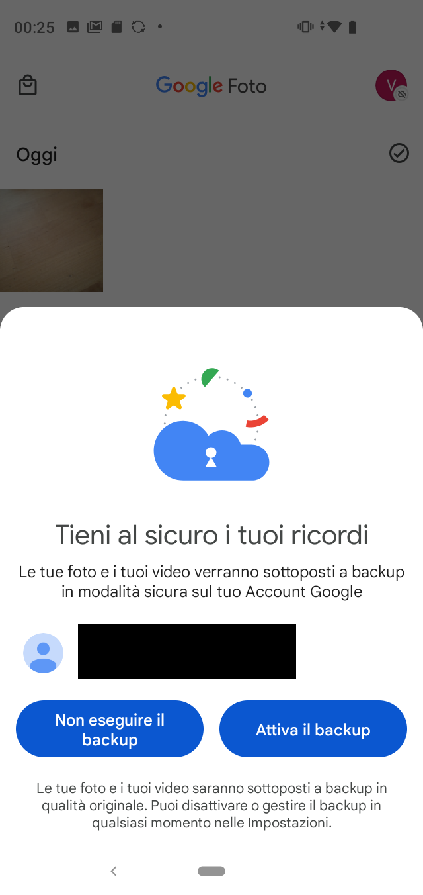

# Prefazione:
Questa guida non e' per i paranoici che vogliono tenere i propri dati per se stessi,

e' pensata per utenti meno esigenti a cui serve salvare le foto nel caso il proprio smartphone si rompa, sparisca, prenda fuoco.

L'obiettivo e' quello di implementare un metodo di backup delle foto in modalita' "imposta e dimentica", in questo modo la richiesta di manutenzione dello strumento e' bassa, quindi ci saranno maggiori possibilita' che esso funzioni quando ce ne sara' bisogno.

Questa guida usa applicazioni commerciali, a volte a pagamento.

Prima svisceriamo i costi e lo spazio messo a disposizione e poi le impostazioni sulle due diverse tipologie di smartphone: iPhone e Android.

# Costi e spazio

## iCloud
iCloud, il cloud di Apple, e' la soluzione nativa per il backup degli iPhone/iPad,
un profilo iCLoud e' gratuito e "regala" 5GB di spazio per i backup, non sono tanti.

### Costi mensili di eventuali upgrade di spazio:
- 5 GB: gratisse
- 50 GB: € 0,99
- 200 GB: € 2,99
- 2 TB: € 9,99

### Condivisione:
e' possibile condividere lo spazio acquistato con altre 5 persone (se sono invitate sulla tua famiglia)

NB: non e' possibile cambiare famiglia per piu' di una volta all'anno, mi pare

### Varie:
- e' raggiungibile via interfaccia WEB?: **si**
- e' possibile scaricare semplicemente le foto dall'interfaccia web?: **si, circa, vedi [nota0] in fondo**

### NB:
iPhone di default salva foto e video in formato proprietario, se non si hanno esigenze particolari il consiglio e' quello di impostarlo in modalita' piu' compatibile: 
1. Vai su Impostazioni > Fotocamera.
2. Tocca Formati.
3. Tocca Più compatibile. Questa impostazione è disponibile solo sui dispositivi in grado di acquisire file multimediali in formato HEIF o HEVC e solo quando si utilizza iOS 11 o versioni successive.
4. Tutte le nuove foto e i nuovi video utilizzeranno ora il formato JPEG o H.264. Per tornare a utilizzare i formati HEIF e HEVC, che consentono un maggiore risparmio di spazio, scegli Efficienza elevata.

fonte: https://support.apple.com/it-it/HT207022

## Google Photos
Un account Google "regala" 15GB di spazio, la sottoscrizione per maggior spazio si chiama "Google One"

### Costi mensili di eventuali upgrade di spazio:
- 15 GB: gratisse
- 100 GB: 1.99/mese o 19.99/anno
- 200 GB: 2.99/mese o 29.99/anno
- 2 TB: 9.99/mese o 99.99/anno

### Condivisione:
e' possibile condividere lo spazio acquistato con altre 5 persone (se sono invitate sulla tua famiglia, mi pare)

## Amazon Photos
Amazon Photos funziona in maniera diversa: ogni account ha gratis 5 GB ma se hai Amazon Prime hai spazio di archiviazione illimitato per le foto (ma non per i video)

### Costi mensili di eventuali upgrade di spazio:
- 5 GB: gratisse
- illimitato: 4.99/mese o 49.90/anno (Amazon Prime)

### Condivisione:
a quanto pare non in Italia, che io abbia capito [nota1]

### Note:
non c'e' separazione degli account come su iCloud/Google, quindi se si usa per smartphone di persone diverse queste vedranno le foto scattate anche dall'altro/a.
che per la privacy non e' ottimale

## Condivisione degli account:
per iCloud e Google Photos e' possibile aggiungersi ad altri utenti che condividono il proprio abbonamento,
mio cuggino usa spliiit.com per alcune cose.

Esempio: un utente compra iCloud da 2TB a 9.99/mese e decide di condividerlo con altri sulla piattaforma,
uno slot viene a costare 9.99/6 posti = 1.66 euri/mese a testa
Tu chiedi di essere inserito/a nella famiglia in modo da poter godere dello spazio in piu', gli fornisci il tuo contatto iCloud e l'utente ti aggiunge.

**ATTENZIONE**: l'inserimento in famiglia a volte conincide con la condivisione di alcuni dati tipo la posizione su iCloud, vanno rivisti questi parametri (non e' oggetto di questa guida sviscerare queste impostazioni)

# iOS - iPhone

## iOS/iPhone - iCloud (nativa)
- 1: Andare nelle Impostazioni e selezionare il proprio nome appena sotto la barra della ricerca 

- 2: Selezionare "iCloud" ("5GB" varia in base a quanto spazio hai disponibile) 

- 3: Selezionare "Foto" 

- 4: Verificare che "Sincronizza questo iPhone" sia selezionato 

- 5: Quindi aprire l'applicazione "Foto"
- 6: Nella pagina "Libreria", in fondo, c'e' lo stato di sincronizzazione 

NB: la sincronia si ferma quando la batteria e' bassa o non si e' attaccati al WiFi

## iOS/iPhone - Google Photos
1. installare l'app Google Foto: https://apps.apple.com/it/app/google-foto/id962194608 e aprirla
2. Selezionare "Accedi" 

3. Loggarsi con il proprio account (immagine non disponibile)
4. Selezionare "Esegui backup come..." selezionando l'account giusto 

5. Selezionare "Consenti" 

6. Selezionare "Consenti l'accesso a tutte le foto" 

7. Selezionare di nuovo "Consenti l'accesso a tutte le foto" 

8. Vedere l'upload dalla schermata dell'applicazione: 

## iOS/iPhone - Amazon Photos
1. installare l'app Amazon Photos: https://apps.apple.com/us/app/amazon-photos-photo-video/id621574163
2. accedere con il proprio account: 
 

3. Selezionare "Consenti Notifiche" 

4. Consentire accesso alle foto: 

5. Selezionare "Consenti l'accesso a tutte le foto" 

6. Selezionare "Salvataggio Automatico" e "Fine" 

7. Vedere l'upload dalla schermata dell'applicazione: 

# Android

## Android - Google Photos (nativa)
1. nel caso non fosse gia' presente, installare l'app di Google Foto: https://play.google.com/store/apps/details?id=com.google.android.apps.photos&hl=it&gl=US
2. cliccare su "Attiva il Backup" 

## Android - Amazon Photos
1. installare l'app Amazon Photos: https://play.google.com/store/apps/details?id=com.amazon.clouddrive.photos&hl=it&gl=US
2. aprirla e loggarsi con il proprio account di Amazon
3. verificare che "Salvataggio automatico" sia selezionato e cliccare su "Avanti"

4. Consentire l'accesso alle foto 

5. Selezionare "Consenti"

# Siti Web

## Sito Amazon Photos:
<a href="../images/guide/web_amazon-photos.png">

## Sito Google Foto:
<a href="../images/guide/web_google-photos.png">

## Sito iCloud Foto:
<a href="../images/guide/web_icloud-photos.png">

# Note:
### [nota0]:
iCloud permette di scaricare le foto dal'interfaccia web ma la data di creazione del file sara' quella in cui la ho scaricata,
per esempio, se e' l' 11 Giugno alle 16:00 e scarico una foto fatta il 15 Maggio alle 09:00 mi ritrovo con il file:
IMG_1234.JPG con data di creazione del file: 11 Giugno ore 16:00
dentro i dati exif dell'immagine ci sara' invece scritto che e' stata scattata il 15 Maggio alle ore 09:00

### [nota1]:
sembra sia attivo in altri paesi tipo la Francia,
vedi: https://www.spliiit.com/it/blog/post/comment-partager-son-compte-amazon-prime
lo dice anche Aranzulla: https://www.aranzulla.it/come-condividere-amazon-prime-1320641.html
  
# TODO:
- [ ] sistemare link delle applicazioni che sono solo testo
- [ ] sistemare formattazione foto nei passaggi
- [ ] aggiungere come scendere nella tana del bianconiglio per selfhost/avere i propri dati
